# 🛒📊 Sistema de Ventas — Aplicación en C# Windows Forms

✨ Aplicación de escritorio para la gestión de clientes, productos y ventas ✨

---

## 🌷✨ Descripción del Proyecto

Este sistema permite administrar el proceso de ventas de manera organizada, registrando clientes, productos y facturas.

El sistema facilita el control comercial mediante formularios intuitivos, validaciones y cálculos automáticos para el total de cada venta.

Fue desarrollado utilizando **C# Windows Forms** con **arquitectura por capas** y base de datos en **SQL Server**, aplicando buenas prácticas de programación y manejo de datos.

---

## 🎯 Objetivo

Brindar una herramienta que permita:

✅ Registrar clientes
✅ Gestionar productos
✅ Realizar ventas y facturación
✅ Visualizar detalles de cada venta
✅ Mantener la información organizada en base de datos

---

## 🛠️💻 Tecnologías Utilizadas

💜 C# (.NET Framework)
🖥️ Windows Forms
🧠 Visual Studio
🗄️ SQL Server
🏗️ Arquitectura por capas (Presentación, Negocio, Datos, Entidades)
📊 DataGridView para visualización de información
⚙️ Procedimientos almacenados para operaciones en la base de datos

---

## 📋🌸 Funcionalidades

✏️ Registro, edición y eliminación de clientes
📦 Registro y gestión de productos
🧾 Creación de ventas
📑 Detalle de venta con cálculo automático de subtotal y total
🔎 Búsqueda de registros
🗂️ Visualización de facturas
✅ Validaciones de datos en formularios
🔄 Actualización automática de tablas en pantalla

---

## 🗄️📊 Base de Datos

El sistema utiliza una base de datos relacional que incluye:

* Cliente
* Producto
* Venta
* Detalle_Venta

Se implementan **procedimientos almacenados** para inserción, consulta, actualización y eliminación de registros.

---
## 🖼️✨ Evidencias del sistema

<table>

<tr>
<td align="center">
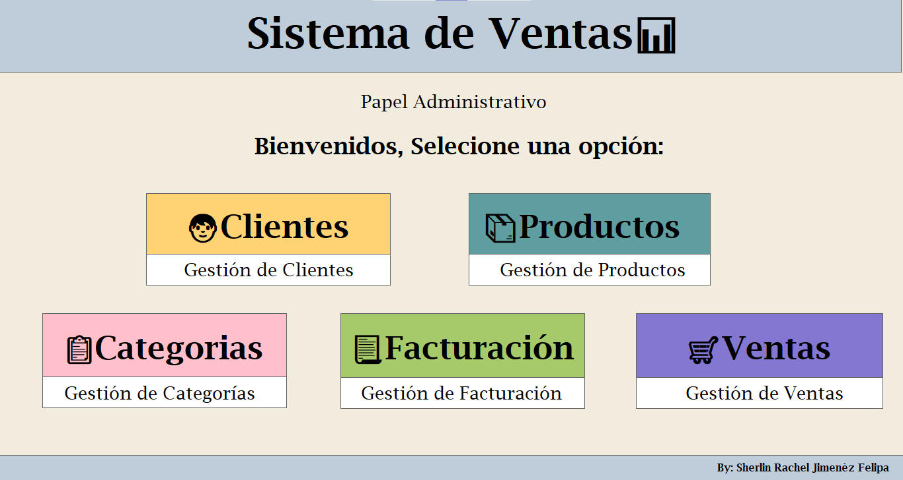 
<b>Pantalla principal</b>
</td>
<td align="center">
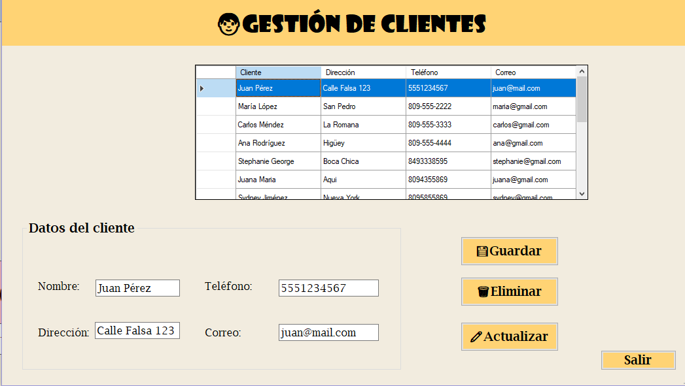 
<b>Registro de clientes</b>
</td>
<td align="center">
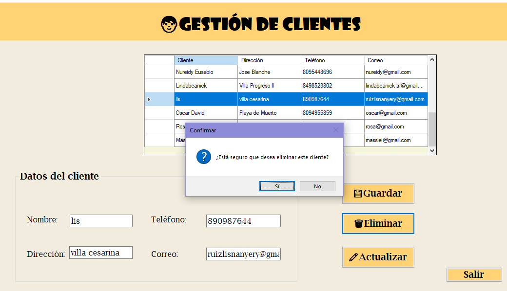 
<b>Listado de clientes</b>
</td>
</tr>

<tr>
<td align="center">
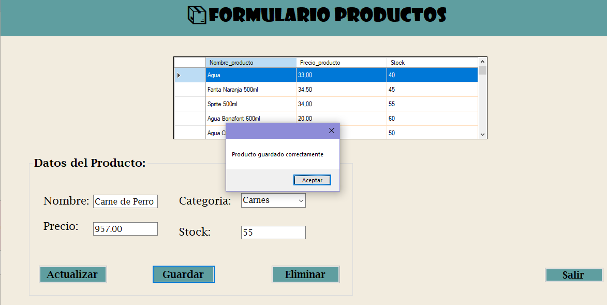 
<b>Registro de productos</b>
</td>
<td align="center">
 
<b>Listado de productos</b>
</td>
<td align="center">
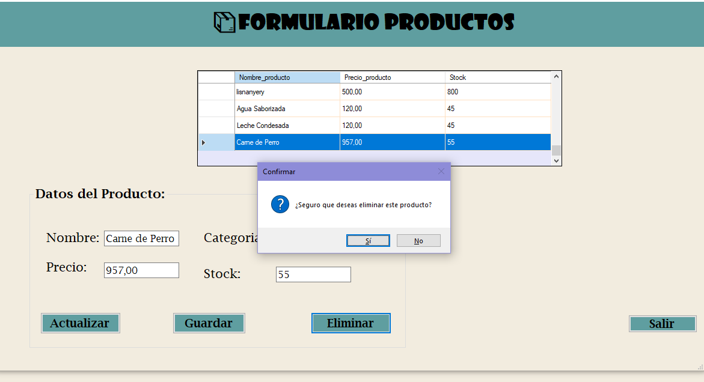 
<b>Edición de clientes</b>
</td>
</tr>

<tr>
<td align="center">
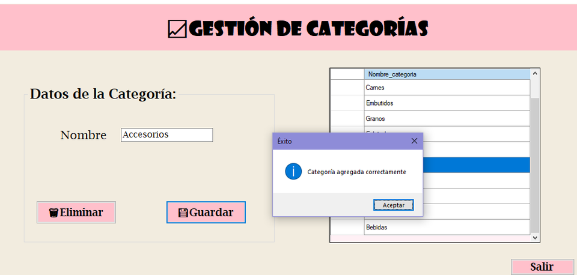 
<b>Edición de productos</b>
</td>
<td align="center">
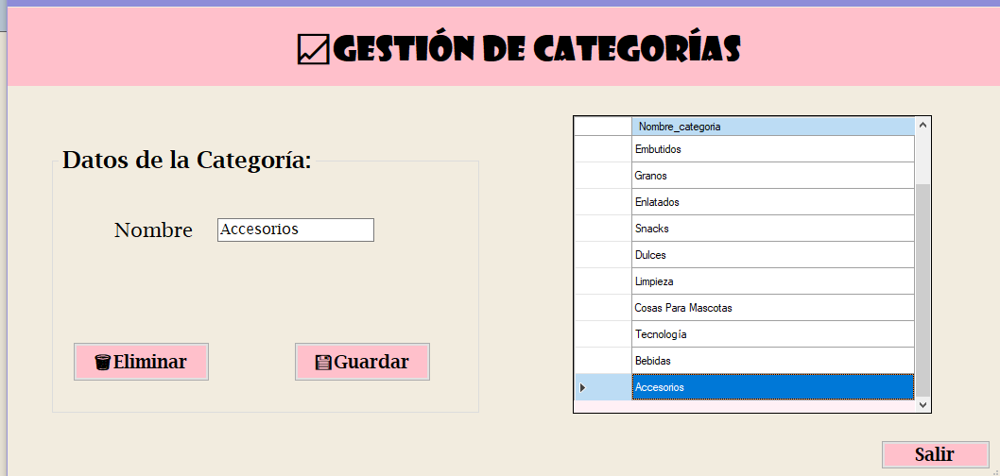 
<b>Creación de ventas</b>
</td>
<td align="center">
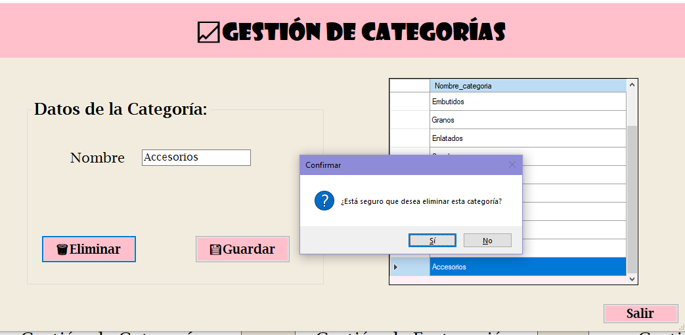 
<b>Selección de cliente</b>
</td>
</tr>

<tr>
<td align="center">
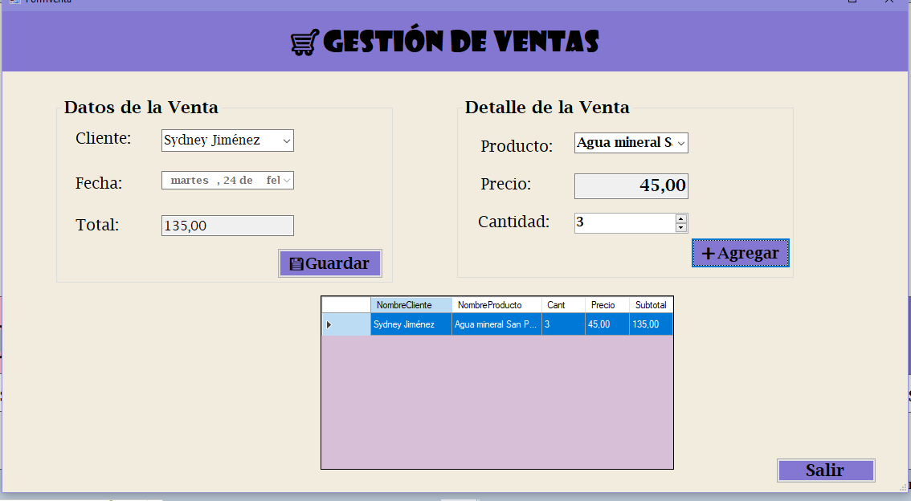 
<b>Agregar productos</b>
</td>
<td align="center">
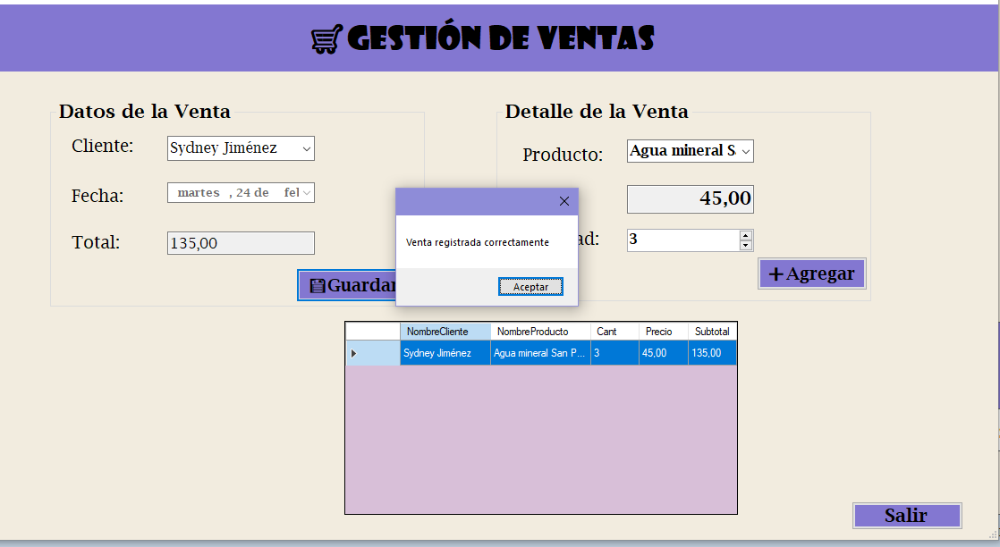 
<b>Cálculo de totales</b>
</td>
<td align="center">
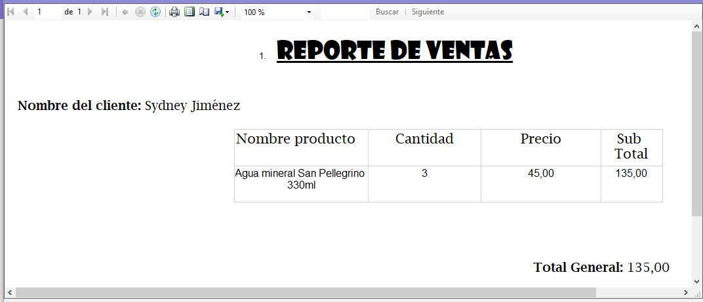 
<b>Listado de ventas</b>
</td>
</tr>

<tr>
<td align="center">
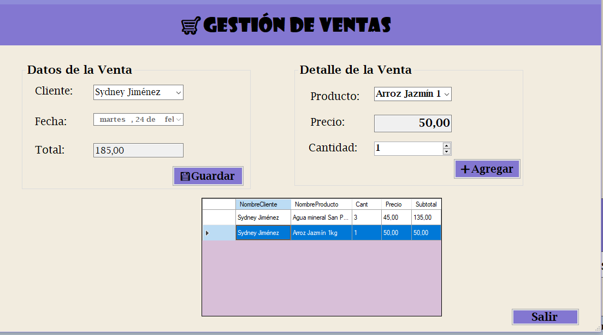 
<b>Detalle de venta</b>
</td>
<td align="center">
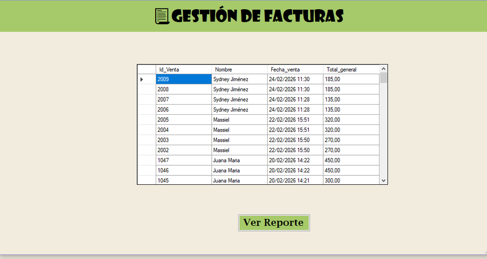 
<b>Generación de factura</b>
</td>
<td align="center">
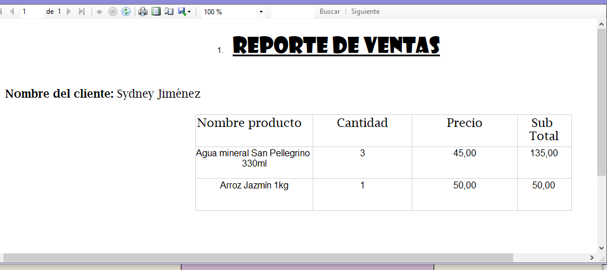 
<b>Validaciones formularios</b>
</td>
</tr>

</tr>

</table>

---

## 🌸📚🎀 Datos Académicos

🏫 Nivel: Secundario Técnico Profesional
💻 Módulo: Desarrollo de Aplicaciones Informáticas
📚 Curso: 5to D-2
🗓️ Año escolar: 2025-2026

---

## 👩‍💻🎀 Autor

Estudiante: **Sherlin Racuel Jiménez Felipa**

---

## ⭐ Observaciones

Este sistema demuestra la integración entre interfaz gráfica y base de datos, permitiendo simular un entorno real de ventas y facturación.

💗 Hecho por Sherlin con compromiso, práctica y amor por el aprendizaje 💗
